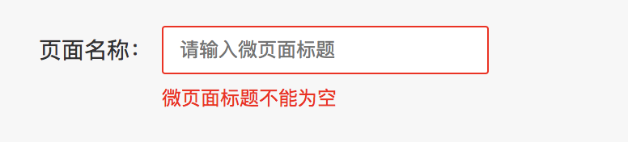
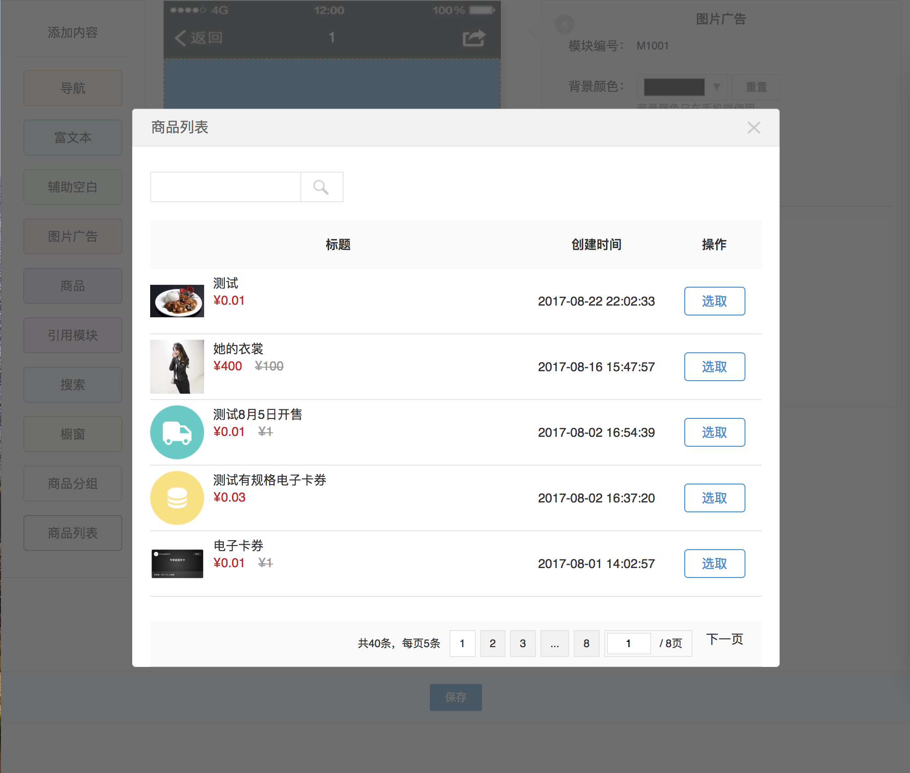
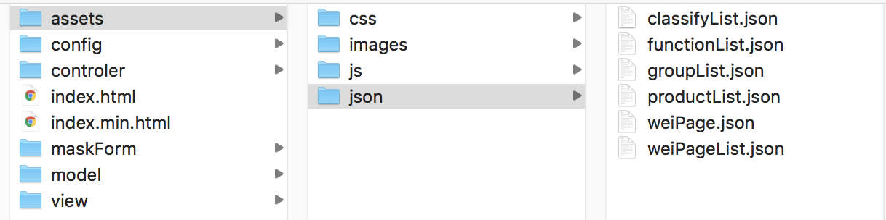
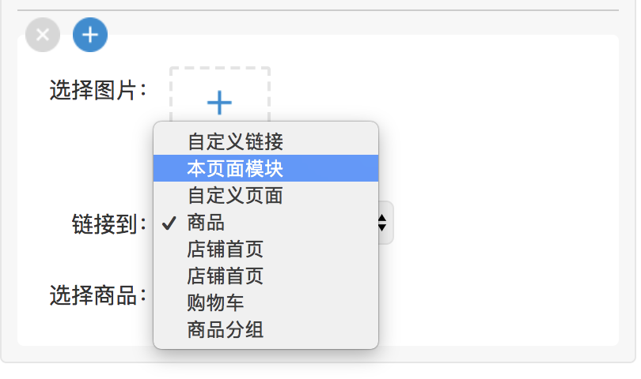
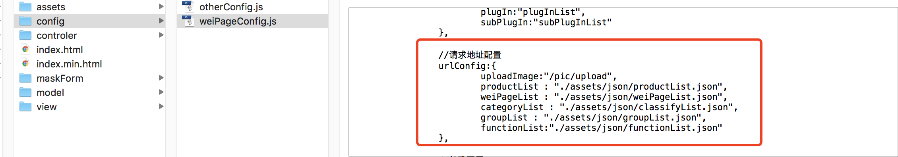
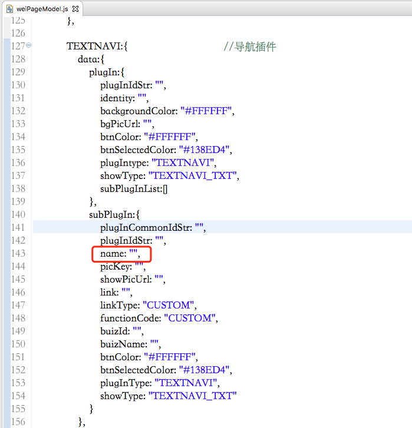

# 微页面使用文档

## 1. 什么是微页面，微页面有什么用。

由于运营人员经常会根据时事及流行风格创建一些用于活动使用的页面，经开发人员开发后发布不仅浪费宝贵推广时间，也浪费开发成本。微页面的初衷就是为了解决让运营人员自己编辑创建活动页面乃至商店首页的功能。

由于目前推广渠道众多，所以当运营人员根据微页面插件设计完一个微页面插件后，点击保存会把微页面以json的数据格式导出设计数据，然后把导出数据保存到数据库，当用户打开对应的微页面会根据id获取对应导出的json格式数据并还原出微页面界面，小程序和安卓及苹果APP同理。

## 2. 微页面demo怎么运行

微页面里面index.html及index.min.html在浏览器运行即是微页面的demo。**由于demo里面使用了jQuery的load读取html页面作为模板及读取本地json文件模拟对服务端发起请求，如果在电脑本地直接用浏览器打开这2个功能都会报跨域错误。**

解决方法一：把浏览器设置成允许跨域，在百度上搜索“chrome跨域设置”，按照流程设置即可。

解决方法二：如果你自己本身会Java、PHP、C#等服务端开发，把微页面文件夹拖进你的工程，启动本地服务，然后访问index.html或index.min.html即可。

index.html和index.min.html的功能是一模一样的，因为微页面里面每个插件都会有对应的几个模板，都写在同一个页面过于乱，所以我把插件模板迁移到view文件夹，弹框模板迁移至maskForm文件夹，然后使用jQuery的load将页面“include”到index.min.html上。

## 3. 微页面的form表单校验如何配置

微页面的表单可以通过配置的方式实现自动校验，如下图所示：



共有以下6种校验，需要校验的表单先寻找到对应的form模板，在对应的标签加上对应的属性即可：

<table>
<tr>
  <th>校验类型</th>
  <th>标签属性</th>
  <th>备注</th>
</tr>
<tr>
  <td>非空校验</td>
  <td>&lt;p&gt;&lt;input data-check="notEmpty" /&gt;&lt;/p&gt;<br/>&lt;p data-check="notEmpty"&gt;不可为空&lt;/p&gt;</td>
  <td></td>
</tr>
<tr>
  <td>文本长度校验</td>
  <td>&lt;p&gt;&lt;input data-check="textLength" data-check-minlen="0" data-check-maxlen="100" /&gt;&lt;/p&gt;<br/>&lt;p data-check="textLength"&gt;文本长度不对&lt;/p&gt;</td>
  <td></td>
</tr>
<tr>
  <td>数值范围校验</td>
  <td>&lt;p&gt;&lt;input data-check="numberSize" data-check-minsize="1" data-check-maxsize="99" data-check-minsizeex="0" data-check-maxsizeex="100"  /&gt;&lt;/p&gt;<br/>&lt;p data-check="numberSize"&gt;数值范围不对&lt;/p&gt;</td>
  <td>ex结尾的代表不包含该值</td>
</tr>
<tr>
  <td>手机号码校验</td>
  <td>&lt;p&gt;&lt;input data-check="mobileReg" /&gt;&lt;/p&gt;<br/>&lt;p data-check="mobileReg"&gt;手机号码格式不对&lt;/p&gt;</td>
  <td></td>
</tr>
<tr>
  <td>邮箱校验</td>
  <td>&lt;p&gt;&lt;input data-check="emailReg" /&gt;&lt;/p&gt;<br/>&lt;p data-check=" emailReg "&gt;邮箱格式不对 &lt;/p&gt;</td>
  <td></td>
</tr>
<tr>
  <td>身份证校验</td>
  <td>&lt;p&gt;&lt;input data-check="idcardReg" /&gt;&lt;/p&gt;<br/>&lt;p data-check="idcardReg"&gt;身份证格式不对 &lt;/p&gt;</td>
  <td></td>
</tr>
</table>

## 4. 微页面的依赖什么服务端配置接口

微页面并不是所有数据都是需要通过手动编写的，比如要把某个单元格当做一个商品的货架来使用，我们最简便的方式是通过去请求服务端的接口读取商品列表，然后运营人员通过选择某个商品，然后直接把商品对应的信息导入到微页面插件中。如下图效果：



微页面目前暂时提供商品列表、分类列表、商品分组列表、微页面列表四个列表选项，数据格式可分别参照productList.json、classifyList.json、groupList.json、weiPageList.json。



控制弹框的连接到的选项列表的数据格式为functionList.json的数据格式。



配置以上请求的url地址的配置在weiPageConfig.js里面的urlConfig里。



**综合上述：要配置微页面与服务端关联数据，服务端需要提供productList.json、classifyList.json、groupList.json、weiPageList.json、functionList.json这个5个文件里数据格式相同的接口，然后把urlConfig中的地址换成服务端提供的地址即可。**

## 5. 微页面的其他功能

图片上传功能：需要把urlConfig里的uploadImage的参数换成服务端提供的图片上传接口的地址。

富文本插件功能：你需要配置百度ueditor的服务端配置环境，然后把/config/otherConfig.js的注释去掉即可。

## 6. 微页面架构介绍

微页面依赖的第三方类库有jQuery和template以及富文本所用到的ueditor。其它的代码均作者所开发，如有发现bug请联系作者。

### 底层部分：

微页面最核心的框架代码位于assets/js/detaEngine.js，负责微页面的所有深度数据处理，该脚本作为微页面的数据处理器，但不耦合微页面的具体功能，有兴趣的同学也可以通过该脚本做其它的作品开发。

assets/js/formCheck.js负责微页面表单的校验操作。index.min.html第141行至148行是对formCheck的具体实现。

assets/js/maskTabDialog.js负责导入服务端接口返回数据的弹框插件实现。

assets/js/pageTuring.js负责弹框里具体表格的渲染实现。

### model部分：

model/weiPageModel.js里是微页面所用到的所有插件的模型数据及各插件配置。

### view部分：

目前微页面共提供了10个插件，view里面除了weiPage文件夹外其余的文件夹都对应着一个插件的实现模板及css样式。

### controler部分：

controler/weiPageService.js是对底层dataEngine的封装实例接口，action都会通过weiPageService间接对dataEngine进行技术操作处理。

controler/weiPageAction.js是微页面各种特殊业务的实现编码。

controler/weiPageViewAction.js负责各种对编辑器的渲染工作。

controler/weiPageDropAction.js负责插件与子插件之间拖拽排序的实现。

controller/weiPageMaskDialogAction.js负责弹框插件的实现实例以及具体的业务实现。

### 其它部分：

config为插件的各种配置，开发者需要结合自身工程实际对配置进行修改。

maskForm为弹框实现的模板。

assets里的其它文件为微页面所需要的一些资源文件。

## 7. 如果微页面一些字段命名和对接的服务端命名不同，如何修改微页面的字段命名

微页面的一些插件的具体属性名往往跟实际使用者的一些业务的命名不同。比如导航的标题微页面插件以name属性表示，如果使用者想要将其改成title属性需要修改一下文件：

1. 修改插件model：找到weiPageModel.js对应的插件TEXTNAVI插件配置，由于该字段属于子插件，所以在subPlugIn中，将name修改title。

2. 修改插件模板：找到view/nav/nav.html模板（index.html的模板在index.html中）。找到里面input等表单标签name=”name”的标签改成name=”title”，接着把{{name}}改成{{title}}即可。有些插件涉及的模板较多，建议查询匹配修改。

## 8. 如何为微页面拓展新功能新插件

拓展插件首先需要写插件的显示模板，表单模板，以及css样式。然后往weiPageModel.js添加一个插件的配置，可参考另外几个插件的配置。接着在index.min.html里面将模板”include”进去。最后在index.min.html里的```weipage_nav_list```添加一个按钮即可。